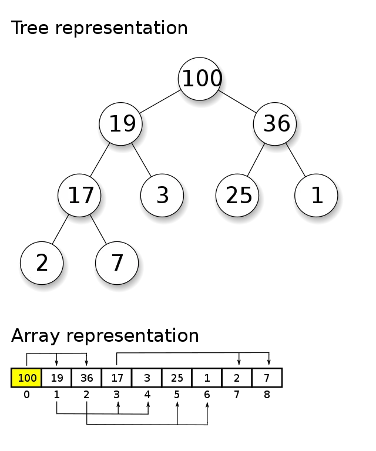

# Implementing Heap In Python

Heap is an elegant data structure that is commonly used for Priority Queue implementation.

> Priority Queue is an abstract data structure, defines the behavior and interface, whereas
> Heap is a concrete data structure defining how it is implemented.

An implementation of a priority queue generally provides the following methods:

* _Insert(H, x)_: Given item _x_, insert into priority queue _H_
* _Find(H)_: returns the element with the highest priority in queue _H_. Priority is commonly
defined either by the largest or smallest key value among elements
* _Delete(H)_: remove the element with the smallest (or largest) value in the priority
queue _H_

In this article, I will focus on Binary-Heap implementation, which means that a node can
have at most two children. In a min-heap, a node dominates its children by having a
smaller key than they do, while in a max-heap parent nodes dominate by being bigger.



The data can be represented in an array of keys, in which the position of the left and
right children can be deduced with a simple mathematical relationship. Given an element
of index _k_:

* **left child index**: _2*k + 1_
* **right child index**: _2*k + 2_
* **parent index**: _k /2_ (taking the floor)

Heaps work by maintaining a partial order on the set of elements that is weaker than the
sorted order (so it can be efficient to maintain) yet stronger than random order (so the
minimum element can be quickly identified).

## Applications and Usages

We model several processes in our daily-basis with a priority queue, an example would be
patients waiting in line at a hospital, where the severity of the injury could be used
as the priority rule. Another great example is given by Skiena:

> Dating is the process of extracting the most desirable person from the data structure
> (Find-Maximum), spending an evening to evaluate them better, and then reinserting them
> into the priority queue with a possibly revised score.

Other than that, they are widely used in other algorithms such as:

* **Sorting**: heapsort has _O(n * logn)_ time complexity at worst
* **Greedy Graph Search — A* and Djikstra**: greedy algorithms, such as the Djikstra’s shortest path, can use heaps to store priority-node pairs
* **Huffman Coding**: heaps can be used to store and retrieve the two lowest-frequency trees

**Bonus**: There is a well-known Facebook phone interview question that can be solved
with a Min-Heap. The question was reported by the
[Keep on Coding channel](https://www.youtube.com/watch?v=pQfagNu3p54):

> Given a list of flight start and end times, determine the maximum amount of airplanes
> in the air at the same time.
>
> Example Input:
>
> Start: 2, End: 5
>
> Start: 3, End: 7
>
> Start: 8, End: 9
>
> Return: 2

### Python’s stdlib Implementation

On Python’s standard library, the API for heaps can be found in
[heapq](https://docs.python.org/3/library/heapq.html) module. For instance, one can
heapify an array (_min-heap_, in this case) by doing:

```python
import heapq

unsorted_array = [100, 230, 44, 1, 74, 12013, 84]

# in-place transformation into min-heap in linear time
heapq.heapify(unsorted_array)
print(unsorted_array)
# [1, 74, 44, 230, 100, 12013, 84]
# ---------------------------------
#                 1
#       74                44
#   230    100      12013    84
#

# Sorting
sorted_array = []
for _ in range(len(unsorted_array)):
    sorted_array.append(heapq.heappop(unsorted_array))

print(sorted_array)
# [1, 44, 74, 84, 100, 230, 12013]
```

## Custom Implementation

The implementation of **MinHeap** consists of defining an internal _list_, storing the
elements, and implementation of the following methods:

* _peek_ (or find-minimum): returns the smallest key stored in constant time
* _add_: insert an element in the heap in its appropriate location
* _poll_ (or extract-min): removes the smallest key stored in the heap

In the end, I will implement a _heapsort_ function which will become straightforward
once we define our _MinHeap_ class.

## Helper Methods

The class implementation will start with some helpers implementing the basic mathematical
relationship among parents, right and left children. Those methods will help in getting
a given child or parent and accessing it.

Also, we can define them as private, even though private encapsulation in Python does
not go beyond [name mangling](https://docs.python.org/3/tutorial/classes.html#private-variables),
I will keep them private for semantic purposes.

```python
from __future__ import annotations
from typing import List, Optional

import sys


class MinHeap:
    """
    Abstracting the node data as Int but could be Any, given a custom comparison
    function to guide ourselves on how to compare the nodes.
    """
    nodes: List[int]

    def __init__(self):
        self.nodes = []

    def __len__(self) -> int:
        return len(self.nodes)

    def __get_left_child_index(self, parent_index: int) -> int:
        return 2 * parent_index + 1

    def __get_right_child_index(self, parent_index: int) -> int:
        return 2 * parent_index + 2

    def __get_parent_index(self, child_index: int) -> int:
        return (child_index - 1) // 2

    def __has_left_child(self, parent_index: int) -> bool:
        return self.__get_left_child_index(parent_index) < len(self.nodes)

    def __has_right_child(self, parent_index: int) -> bool:
        return self.__get_right_child_index(parent_index) < len(self.nodes)

    def __has_parent(self, index: int) -> bool:
        return self.__get_parent_index(index) >= 0

    def __left_child(self, index: int) -> Optional[int]:
        if not self.__has_left_child(index):
            # Virtual -inf
            return -sys.maxsize
        return self.nodes[self.__get_left_child_index(index)]

    def __right_child(self, index: int) -> Optional[int]:
        if not self.__has_right_child(index):
            # Virtual -inf
            return -sys.maxsize
        return self.nodes[self.__get_right_child_index(index)]

    def __parent(self, index: int) -> Optional[int]:
        if not self.__has_parent(index):
            return None
        return self.nodes[self.__get_parent_index(index)]
```

We will change the `__init__` to receive a list of elements once we implement the
insertion methods.

### Inserting into the MinHeap

Inserting a key into a heap is always a 2-step approach. First, we want to add the
incoming key into the array as fast as possible, which means appending to the end. Then,
we want to __heapify-up__ (or __bubble up__) this newly-added element to its correct
position.

The process of moving the new element to its appropriate position is going to be defined
by the __heapify-up__ function, which will recursively execute the following:

1. Get the element (starting with the last one)
2. Check if it disobeys the priority rule, in this case (min-heap), check if its key
value is **smaller** than the parent
3. If smaller, then swap with its parent
4. Recurse in the index of the parent
5. Keep bubbling up until reaching the root

I will also define a helper method for swapping elements, this will be done constantly
in heap operations.

```python
class MinHeap:
    nodes: List[int]

    def __init__(self, nodes: List[int] = []):
        self.nodes = []
        for node in nodes:
            self.add(node)

    # Helper methods defined previously:
    # __get_left_child_index
    # __get_right_child_index
    # __get_parent_index
    # ...

    def __swap(self, first_idx: int, second_idx: int):
        if first_idx >= len(self.nodes) or second_idx >= len(self.nodes):
            print(f'first ({first_idx}) or second ({second_idx}) are invalid')
            return
        tmp = self.nodes[first_idx]
        self.nodes[first_idx] = self.nodes[second_idx]
        self.nodes[second_idx] = tmp

    def __heapify_up(self, child: Optional[int] = None):
        """Move last added element to correct position in heap"""
        if not child:
            # Start with last
            child = len(self.nodes) - 1
        # Check if smaller than parent
        parent_idx = self.__get_parent_index(child)
        if self.__parent(child) and self.nodes[child] < self.__parent(child):
            # Swap child <> parent
            self.__swap(child, parent_idx)
            # Recurse on parent index now (should have child value)
            self.__heapify_up(child=parent_idx)
        # If its not smaller, leave as it is
        return self.nodes

    def add(self, item: int):
        self.nodes.append(item)
        self.__heapify_up()
```

Now, the `__init__` can receive a list of elements and add them to the heap.

### Deleting from the MinHeap

Similar to the insertion, deleting from the heap is a 2-step process consisting of first
removing the highest-priority key, then reorganizing the heap. The first process is
simply removing the first element of the array, which is tricky since for large arrays
it involves a big memory shift, thus complexity can go up to _O(n)_. Due to that, we do
not simply remove the first one, what we actually do is copy the last element to the
first position and then shrink the size of the array by 1.

After moving the last element to the first position and shrinking, we proceed to
__heapify-down__ (or __bubble-down__) the first element to its correct position in the heap.
This is done recursively by executing the following steps:

1. Get the element key (starts with the first element)
2. Check if the key is greater than any of the children (left or right)
3. If greater, than it is in the wrong position, swap with the smallest between left and right
4. Continue to heapify down with the smallest child index
5. Repeat until no more children

The _heapify down_ process takes _O(log n)_ time complexity since as we navigate through
the heap we always split in half the number of paths — by choosing one of the children.

```python
class MinHeap:
    nodes: List[int]

    def __init__(self, nodes: List[int] = []):
        self.nodes = []
        for node in nodes:
            self.add(node)

    # Helper methods defined previously:
    # __get_left_child_index
    # __get_right_child_index
    # __get_parent_index
    # ...

    def __swap(self, first_idx: int, second_idx: int):
        if first_idx >= len(self.nodes) or second_idx >= len(self.nodes):
            print(f'first ({first_idx}) or second ({second_idx}) are invalid')
            return
        tmp = self.nodes[first_idx]
        self.nodes[first_idx] = self.nodes[second_idx]
        self.nodes[second_idx] = tmp

    # Commenting out insertion methods: add() and heapify_up()

    def __heapify_down(self, index: Optional[int] = 0):
        """Move root to proper position in heap"""
        if index >= len(self.nodes) or not self.__has_left_child(index):
            return self.nodes
        # Check if greater than left or right
        smaller_child_idx = self.__get_left_child_index(index)
        if self.__has_right_child(index) and \
                self.__right_child(index) < self.__left_child(index):
            smaller_child_idx = self.__get_right_child_index(index)

        if self.nodes[index] < self.nodes[smaller_child_idx]:
            # Lower than both, do nothing
            return self.nodes

        if self.nodes[index] > self.nodes[smaller_child_idx]:
            # Swap with smaller child
            self.__swap(index, smaller_child_idx)
            return self.__heapify_down(smaller_child_idx)

    def poll(self) -> Optional[int]:
        """
        Polls lowest element from the heap (usually root). To avoid memory shift
        of first-element removal, we copy the last element to the first
        position, shrink the size by 1 and heapify down.
        """
        if self.is_empty():
            print('Empty, not polling')
            return None

        # Remove first and insert the last one added as the root
        removed_node = self.nodes[0]
        self.nodes[0] = self.nodes[len(self.nodes) - 1]
        # Shrink size by 1
        # Could've also used self.nodes = self.nodes[:-1]
        del self.nodes[-1]

        self.__heapify_down()
        return removed_node
```

### Peek

The _peek_ operation needs to return the smallest key from the heap, in our case, this
is the first element of the heap — given in constant time.

```python
class MinHeap:
    nodes: List[int]

    def __init__(self, nodes: List[int] = []):
        self.nodes = []
        for node in nodes:
            self.add(node)

    # Commenting out helper methods defined previously:
    # __get_left_child_index
    # __get_right_child_index
    # __get_parent_index
    # __swap
    # ...

    # Commenting out insertion methods: add() and heapify_up()
    # Commenting out deletion methods: poll() and heapify_down()

    def is_empty(self) -> bool:
        return not self.nodes

    def peek(self) -> Optional[int]:
        if not self.is_empty():
            return None
        return self.nodes[0]

```

### Heapsort

Sorting with heaps then becomes very straightforward, first, we add the unsorted elements
to the heap and keep polling. In each iteration of the polling loop, we are extracting
the smallest key and re-organizing the heap.

The time complexity of this operation is _O(n*log n)_, since each time for each element
that we want to sort we need to _heapify down_, after polling.

#### Advantages

* _O(n * log n)_ time complexity in the worst case
* In-place algorithm

#### Disadvantages

* Not stable
* Very difficult to parallelize compared to other algorithms such as
[Merge Sort](https://en.wikipedia.org/wiki/Merge_sort) and
[Quick Sort](https://en.wikipedia.org/wiki/Quicksort)

#### Using auxiliary space O(n)

```python
class MinHeap:
    nodes: List[int]

    def __init__(self, nodes: List[int] = []):
        self.nodes = []
        for node in nodes:
            self.add(node)

    # Commenting out helper methods defined previously:
    # __get_left_child_index
    # __get_right_child_index
    # __get_parent_index
    # __swap
    # ...

    # Commenting out insertion methods: add() and heapify_up()
    # Commenting out deletion methods: poll() and heapify_down()
    # Commenting out peek() and is_empty()

def heapsort_aux(unsorted_input: List[int]) -> List[int]:
    """ Heapsort using O(n) space """
    heap = MinHeap(unsorted_input)
    sorted_input = []
    for _ in range(len(unsorted_input)):
        sorted_input.append(heap.poll())
    print(f'identity check: {sorted_input is heap.nodes}')
    return sorted_input

if __name__ == '__main__':
    unsorted_array = [10, 15, 8, 20, 17]
    print(f'heapsort with aux space: {heapsort_aux(unsorted_array)}')
    # identity check: False
    # heapsort with aux space: [8, 10, 15, 17, 20]
```

#### In-place

For the in-place variation, we want to heapify the children so that the left child is
always smaller than the right child. By doing that, we enforce that the array will be
sorted at the end — this operation will take _O(n)_ time complexity and still makes our
algorithm _O(n * log n)_

```python
class MinHeap:
    nodes: List[int]

    def __init__(self, nodes: List[int] = []):
        self.nodes = []
        for node in nodes:
            self.add(node)

    # Commenting out helper methods defined previously:
    # __get_left_child_index
    # __get_right_child_index
    # __get_parent_index
    # __swap
    # ...

    # Commenting out insertion methods: add() and heapify_up()
    # Commenting out deletion methods: poll() and heapify_down()
    # Commenting out peek() and is_empty()

    def heapify_children(self, index: int):
        """
        Heapify children of a node to obey left < right.
        """
        if not self.__has_left_child(index):
            return
        if not self.__has_right_child(index):
            return
        if self.__right_child(index) < self.__left_child(index):
            self.__swap(
                self.__get_right_child_index(index),
                self.__get_left_child_index(index))
        self.heapify_children(self.__get_left_child_index(index))
        self.heapify_children(self.__get_right_child_index(index))

def heapsort_in_place(unsorted_input: List[int]) -> List[int]:
    """ Heapsort in-place: heap.nodes is unsorted_input == True """
    heap = MinHeap()
    heap.nodes = unsorted_input
    size = len(unsorted_input)
    print(f'identity check: {heap.nodes is unsorted_input}')
    for idx in range(size // 2, -1, -1):
        heap.heapify_down(idx)
    heap.heapify_children(0)
    return heap.nodes

if __name__ == '__main__':
    unsorted_array = [10, 15, 8, 20, 17]
    print(f'heapsort in-place: {heapsort_in_place(unsorted_array)}')
    # identity check: True
    # heapsort with aux space: [8, 10, 15, 17, 20]
```

### Additional Resources

The complete code can be found here: https://gist.github.com/hspedro/3448a4602ab727ad7d015e9d3e5cd471

This code helped me through multiple code interviews, and also to revisit some basic
data structures fundamentals. I **strongly** recommend checking on these other resources!

* [The Algorithm Design Manual — Chapter 3.5 and Chapter 4.3](https://www.algorist.com/), Steven Skiena
* [Official doc on heapq](https://docs.python.org/3/library/heapq.html), Python
* [The Python heapq Module: Using Heaps and Priority Queues](https://realpython.com/python-heapq-module/#what-are-heaps), Real Python
* [Heapsort](https://en.wikipedia.org/wiki/Heapsort), Wikipedia
