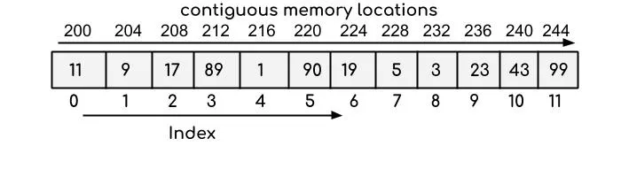
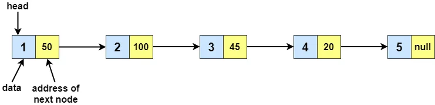

# Implementing Linked Lists in Python

Generally, when studying data structures, we usually start with two types of common data
structures: contiguous and linked. Each of them comes with its drawbacks, so it’s crucial
to understand what is your problem before going deeper into the data structures.

The objective of this article is to help shine a light on how those structures are
implemented in Python, what kind of drawbacks, advantages, and even how you would
implement some of them by yourself. Even though they all have implementations from
Python’s standard library, getting to know how they work, might help you understand when
and how to maximize its usage.

## Python’s List a Contiguous Data Structure

Contiguously allocated structures are composed of single slabs of memory, some examples
are Python’s lists, matrices, heaps, and hash tables.



### Advantages

* Memory locality: physical continuity in memory can make use of highly optimized cache mechanisms
* O(1) complexity to access given the index
* Efficient random access to items in arrays

### Disadvantages

* Removing from the beginning is too costly due to resize
* Space efficiency: Python always allocates a larger size than the elements it has,
to avoid calling realloc each time a new element is appended to the list

### Usages

* **Stacks** (LIFO), good fit since we will always be inserting and removing the last
element at a constant time
* **Heaps**, since each element is a node and the children can be accessed with a
defined relationship. For example, in binary heaps the index of left_child is always
given by **2 * parent_index + 1** and **right_child** as **2*parent_index + 2**
* **Hash Tables**, since an array-like list can be used to store the keys after computing
the hash
* **Depth-First Search (DFS) Algorithm**, generally, implementing a DFS involves using a
stack to store the nodes visited

### Implementation in Python Standard Library:

* Lists: https://docs.python.org/3/tutorial/datastructures.html#more-on-lists
* CPython ref: https://github.com/python/cpython/blob/5c22476c01622f11b7745ee693f8b296a9d6a761/Include/listobject.h#L22
For a more in-depth analysis of how lists are implemented in CPython, check
[Laurent Luce’s article](http://www.laurentluce.com/posts/python-list-implementation/).

## Linked Lists in Python

A linked list is a type of linked data structure, which are structures composed of
different chunks of memory that are linked by pointers. Some examples are trees, graphs
(adjacency list), and linked lists.



Linked data structures have **basic operations such as search, insert, and deletion**.
Also, they share some common properties:

* Each element contains a data field, which can have any type
* Each element contains a pointer to another node

Linked lists can be implemented as:

* **Singly-Linked List**: each element points to one successor element, generally called next
* **Doubly-Linked List**: each element points to one successor and one predecessor element
* **Circular Linked List**: first element points to the last element and the last element points to the first

### Advantages

* O(1) to access the first element
* Insertions put less pressure on memory since it involves only changing the address in
memory that elements point to - avoiding resizing and shuffling
* Deletion is more efficient than in lists since it does not involve reallocations and shuffles
* Overflow on linked structures never occurs unless the memory is actually full
* With large records, moving pointers is easier and faster than moving the
items themselves

### Disadvantages

* O(n) at the worst case for accessing
* O(n) at the worst case for insertion
* Always O(n) for searching, whereas for lists we can use binary search if ordered,
which has O(log n)

### Usages

* **Queues (FIFO)**, good fit since we have constant time at removing the first element
* **Breadth-First Search (BFS) Algorithm**, generally, implementing a BFS involves using
a queue to store the nodes visited
* **Adjacency-List in Graphs**, to store the connections of a vertice
* **Hash Table**, may use linked lists to store the chains of items that hash to the same
position in the hash table

### Implementation in Python Standard Library:

* `collections.deque` (pronounced “deck”): https://docs.python.org/3/library/collections.html#collections.deque

## Custom Implementation of a Singly Linked List

Below you will find an example of how to implement a custom singly linked list in Python, this code helped me prepare for coding interviews. Having a good understanding of how it works, makes it easier to derivate a Doubly-Linked or Circular list implementation.

NOTE: The methods are named after collections.deque API, which supports:

* **append(x)**: Add _x_ to the right side of the linked list
* **appendleft(x)**: Add _x_ to the left side of the linked list
* **pop(x)**: Remove and return an element from the right side of the linked list
* **popleft(x)**: Remove and return an element from the left side of the linked list

### Node Class

Pretty straightforward, as it is a Singly-Linked list, we only need to define a field
for the **next**, pointing to the successor, and a field for **data**, which can receive
any type of data.

```python
from __future__ import annotations
from typing import Any, Optional


class SLLNode:
    def __init__(self, data: Any, next: Optional[SLLNode] = None):
        self.data = data
        self.next = next

    def __str__(self):
        return f"{self.data}"
```

### Singly-Linked List Class

The class can start with its constructor only creating the HEAD node, pointing to `None`,
and may receive a list of nodes to pre-populate the list. In this implementation, I will
leave the HEAD as an element with a `None` value that will point to the first element added.

#### `__iter__(self)`

This method will be crucial to implement the other operations, keep in mind that it is
not strictly necessary for search, append, pop, etc., however, I think it makes the code
more pythonic and uses Python’s [generators](https://docs.python.org/3/c-api/gen.html),
which are much more memory-efficient.

```python
from __future__ import annotations
from typing import Any, List, Optional


class SLLNode:
    def __init__(self, data: Any, next: Optional[SLLNode] = None):
        self.data = data
        self.next = next

    def __str__(self):
        return f"{self.data}"


class SinglyLinkedList:
    """ Custom implementation of a Singly-Linked List"""

    def __init__(self, nodes: Optional[List[SLLNode]] = None):
        # Note: the HEAD node will only contain data as 'HEAD' to
        # print the list. See: __repr__()
        self.HEAD = SLLNode('HEAD', next=None)
        if nodes is not None:
            for node in nodes:
                self.append(node.data)

    def __iter__(self):
        node = self.HEAD
        while node is not None:
            yield node
            node = node.next
```

### Queue operations

Next, we can start implementing basic operations such as insert, remove and search.
For Queue, we generally want to append at the end and remove the first element added,
those operations will be called **append** and **popleft** in the code.

```python
from __future__ import annotations
from typing import Any, List, Optional


class SLLNode:
    def __init__(self, data: Any, next: Optional[SLLNode] = None):
        self.data = data
        self.next = next

    def __str__(self):
        return f"{self.data}"


class SinglyLinkedList:
    """ Custom implementation of a Singly-Linked List"""

    def __init__(self, nodes: Optional[List[SLLNode]] = None):
        # Note: the HEAD node will only contain data as 'HEAD' to
        # print the list. See: __repr__()
        self.HEAD = SLLNode('HEAD', next=None)
        if nodes is not None:
            for node in nodes:
                self.append(node.data)

    def __iter__(self):
        node = self.HEAD
        while node is not None:
            yield node
            node = node.next

    def append(self, data: Any) -> SinglyLinkedList:
        node = self.HEAD
        for node in self:
            pass
        node.next = SLLNode(data)
        return self

    def popleft(self) -> SLLNode:
        if self.HEAD.next is None:
            return None

        previous_first = self.HEAD.next
        self.HEAD.next = previous_first.next
        return previous_first
```

For convenience, we can also add operations to **appendleft**, adding an element as the
first of the queue, and **pop** to remove the last element. Note that, while
**appendleft** is done in constant time O(1), the pop operation needs to traverse the
full list until it finds the last element to remove, thus O(n):

```python
from __future__ import annotations
from typing import Any, List, Optional


class SinglyLinkedList:
    """ Custom implementation of a Singly-Linked List"""

    def __init__(self, nodes: Optional[List[SLLNode]] = None):
        # Note: the HEAD node will only contain data as 'HEAD' to
        # print the list. See: __repr__()
        self.HEAD = SLLNode('HEAD', next=None)
        if nodes is not None:
            for node in nodes:
                self.append(node.data)

    def __iter__(self):
        node = self.HEAD
        while node is not None:
            yield node
            node = node.next

    def append(self, data: Any) -> SinglyLinkedList:
        node = self.HEAD
        for node in self:
            pass
        node.next = SLLNode(data)
        return self

    def pop(self) -> Optional[SLLNode]:
        if self.HEAD.next is None:
            return None

        node = self.HEAD
        while node.next.next:
            node = node.next

        removed_node = node.next
        node.next = None
        return removed_node

    def appendleft(self, data: Any) -> SinglyLinkedList:
        new_node = SLLNode(data)
        if self.HEAD.next is None:
            self.HEAD.next = SLLNode(data)
            return self

        previous_first = self.HEAD.next
        self.HEAD.next = new_node
        new_node.next = previous_first
        return self

    def popleft(self) -> SLLNode:
        if self.HEAD.next is None:
            return None

        previous_first = self.HEAD.next
        self.HEAD.next = previous_first.next
        return previous_first
```

Next, we can add methods to **find** and **remove** a node given a certain data passed as an
argument. Note that in a Doubly-Linked List, those processes would be simpler, since
once we found the node, we can update the predecessor and successor at once. In a
Singly-Linked we need to keep a reference to the predecessor, so that when removing we
update the successor accordingly:

```python
class SinglyLinkedList:
    """ Custom implementation of a Singly-Linked List"""

    def __init__(self, nodes: Optional[List[SLLNode]] = None):
        # Note: the HEAD node will only contain data as 'HEAD' to
        # print the list. See: __repr__()
        self.HEAD = SLLNode('HEAD', next=None)
        if nodes is not None:
            for node in nodes:
                self.append(node.data)

    def __iter__(self):
        node = self.HEAD
        while node is not None:
            yield node
            node = node.next

    def append(self, data: Any) -> SinglyLinkedList:
        node = self.HEAD
        for node in self:
            pass
        node.next = SLLNode(data)
        return self

    def pop(self) -> Optional[SLLNode]:
        if self.HEAD.next is None:
            return None

        node = self.HEAD
        while node.next.next:
            node = node.next

        removed_node = node.next
        node.next = None
        return removed_node

    def appendleft(self, data: Any) -> SinglyLinkedList:
        new_node = SLLNode(data)
        if self.HEAD.next is None:
            self.HEAD.next = SLLNode(data)
            return self

        previous_first = self.HEAD.next
        self.HEAD.next = new_node
        new_node.next = previous_first
        return self

    def popleft(self) -> SLLNode:
        if self.HEAD.next is None:
            return None

        previous_first = self.HEAD.next
        self.HEAD.next = previous_first.next
        return previous_first

    def find(self, data: Any) -> Optional[SLLNode]:
        if self.HEAD.next is None:
            return None

        for node in self:
            if node.data == data:
                return node

    def remove(self, data: Any) -> SinglyLinkedList:
        if self.HEAD.next is None:
            return None

        for node in self:
            if node.next.data == data:
                node.next = node.next.next
                return self
```

### Container Type Methods

In Python, objects that contain references to other objects are called _containers_,
i.e: lists, tuples, and dictionaries. As an approach to operator _overloading_, Python
provides invokes certain methods by special syntax. For instance, accessing an object
with `x[i]` is equivalent to `type(x).__getitem__(x, i)`.

Thus, for convenience, we can implement some of them as the code below suggests:

* [__len__](https://docs.python.org/3/reference/datamodel.html#object.__len__): Called to implement the built-in function `len()`

```python
stack = SinglyLinkedList()
print(len(stack)) # 0
```

* [__contains__](https://docs.python.org/3/reference/datamodel.html#object.__contains__):
Called to implement membership test operators. Should return true if item is in self,
false otherwise. Uses `__iter__()`

```python
stack = SinglyLinkedList(SLLnode('John Doe'))
print('John Doe' in stack) # True
```

* [__getitem__](https://docs.python.org/3/reference/datamodel.html#object.__getitem__):
Called to implement evaluation of `self[key]`

```python
stack = SinglyLinkedList(SLLnode('John Doe'))
print(stack[0]) # 'John Doe'
```

* [__setitem__](https://docs.python.org/3/reference/datamodel.html#object.__setitem__):
Called to implement assignment to `self[key]`

```python
stack = SinglyLinkedList()
stack[0] = SLLNode('Ada Lovelace')
print(stack[0]) # 'Ada Lovelace'
```

* [__delitem__](https://docs.python.org/3/reference/datamodel.html#object.__delitem__):
Called to implement deletion of `self[key]`

```python
stack = SinglyLinkedList(SLLNode('Ada Lovelace'))
print(len(stack)) # 1
del stack[0]
```

```python
class SinglyLinkedList:
    """ Custom implementation of a Singly-Linked List"""

    def __init__(self, nodes: Optional[List[SLLNode]] = None):
        # Note: the HEAD node will only contain data as 'HEAD' to
        # print the list. See: __repr__()
        self.HEAD = SLLNode('HEAD', next=None)
        if nodes is not None:
            for node in nodes:
                self.append(node.data)

    def __iter__(self):
        node = self.HEAD
        while node is not None:
            yield node
            node = node.next

    def __len__(self) -> int:
        return len([node for node in self]) - 1

    def __contains__(self, data: Any) -> bool:
        for node in self:
            if node.data == data:
                return True
        return False

    def __str__(self) -> str:
        node = self.HEAD
        nodes = []
        for node in self:
            nodes.append(str(node))
        nodes.append('None')
        return ' -> '.join(nodes)

    def __getitem__(self, index: int) -> SLLNode:
        if index < 0 and index > len(self) - 1:
            raise IndexError(f'Index {index} out of range')

        node = self.HEAD
        for _ in range(index):
            node = node.next
        return node.next

    def __setitem__(self, index: int, data: Any) -> SinglyLinkedList:
        if index < 0 and index > len(self) - 1:
            raise IndexError(f'Index {index} out of range')

        node = self.HEAD
        for _ in range(index + 1):
            node = node.next
        node.data = data
        return self

    def __delitem__(self, index: int):
        if index < 0 and index > len(self) - 1:
            raise IndexError(f'Index {index} out of range')

        node = self.HEAD
        for _ in range(index):
            node = node.next
        node.next = node.next.next if node.next else None
        return

    def __gt__(self, other: SinglyLinkedList) -> bool:
        if len(self) > len(other):
            return True

    def __lt__(self, other: SinglyLinkedList) -> bool:
        if len(self) < len(other):
            return True

    def __ge__(self, other: SinglyLinkedList) -> bool:
        if len(self) >= len(other):
            return True

    def __le__(self, other: SinglyLinkedList) -> bool:
        if len(self) <= len(other):
            return True

    def __eq__(self, other: SinglyLinkedList) -> bool:
        if len(self) != len(other):
            return False
        for node in self:
            if node.data != other[node.data]:
                return False
        return True

    def __ne__(self, other: SinglyLinkedList) -> bool:
        return not self == other

    def append(self, data: Any) -> SinglyLinkedList:
        node = self.HEAD
        for node in self:
            pass
        node.next = SLLNode(data)
        return self

    def pop(self) -> Optional[SLLNode]:
        if self.HEAD.next is None:
            return None

        node = self.HEAD
        while node.next.next:
            node = node.next

        removed_node = node.next
        node.next = None
        return removed_node

    def appendleft(self, data: Any) -> SinglyLinkedList:
        new_node = SLLNode(data)
        if self.HEAD.next is None:
            self.HEAD.next = SLLNode(data)
            return self

        previous_first = self.HEAD.next
        self.HEAD.next = new_node
        new_node.next = previous_first
        return self

    def popleft(self) -> SLLNode:
        if self.HEAD.next is None:
            return None

        previous_first = self.HEAD.next
        self.HEAD.next = previous_first.next
        return previous_first

    def find(self, data: Any) -> Optional[SLLNode]:
        if self.HEAD.next is None:
            return None

        for node in self:
            if node.data == data:
                return node

    def remove(self, data: Any) -> SinglyLinkedList:
        if self.HEAD.next is None:
            return None

        for node in self:
            if node.next.data == data:
                node.next = node.next.next
                return self
```

The complete code can be found at this gist: https://gist.github.com/hspedro/253afbda49f383f4e7b17e9ae73ab63a

## Other Resources

This code helped me through multiple code interviews, and also to revisit some basic
data structures fundamentals. I **strongly** recommend checking on these other resources!

* [List Implementation in CPython](http://www.laurentluce.com/posts/python-list-implementation/), Laurent Luce
* [Official Doc for Lists](https://docs.python.org/3/tutorial/datastructures.html#more-on-lists), Python Docs
* [Design Details on List Implementation](https://docs.python.org/3/faq/design.html#how-are-lists-implemented-in-cpython), Python Docs
* [Understanding Linked Lists](https://realpython.com/linked-lists-python/#understanding-linked-lists), Real Python
* [The Algorithm Design Manual - Chapter 3](https://www.algorist.com/), Steven Skiena
* [What's A Linked List Anyway](https://medium.com/basecs/whats-a-linked-list-anyway-part-1-d8b7e6508b9d), Vaidehi Joshi
